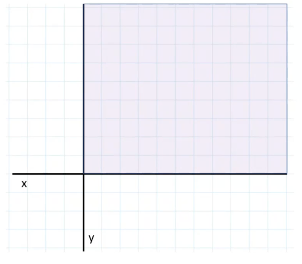
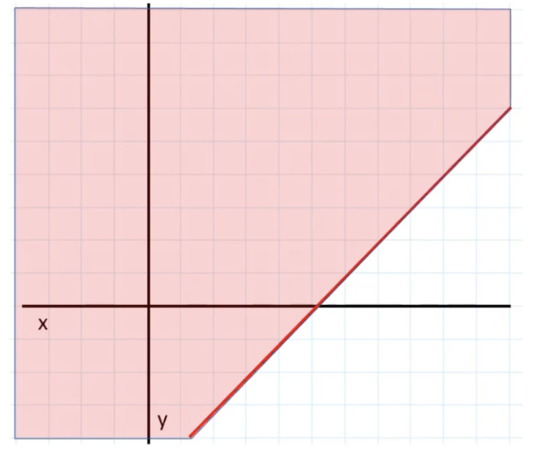
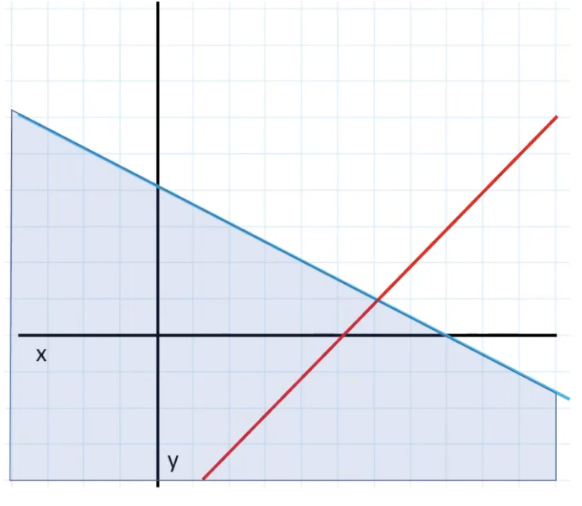
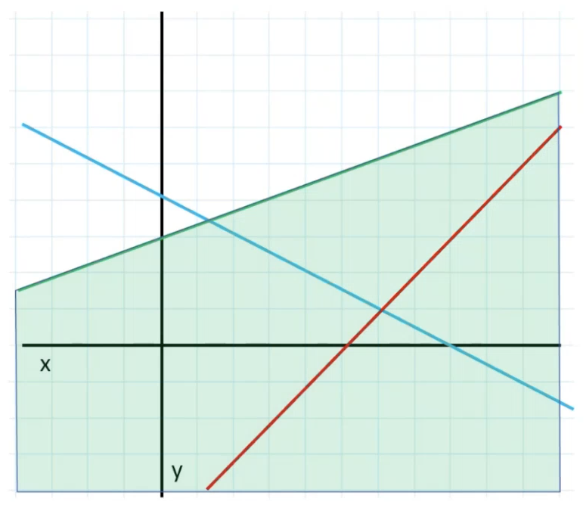
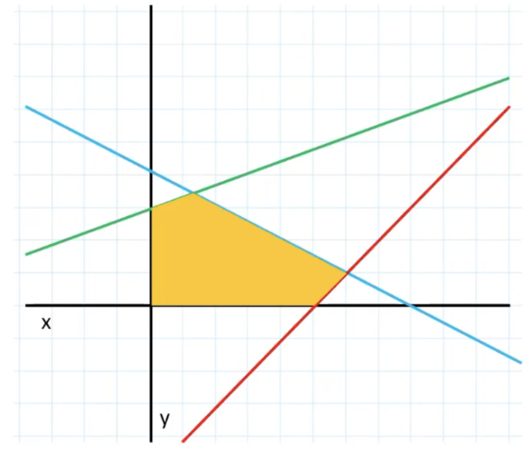
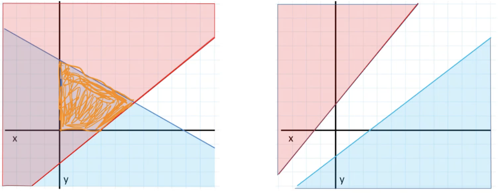
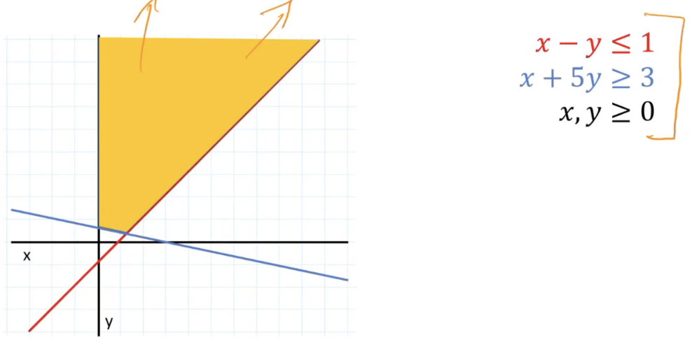
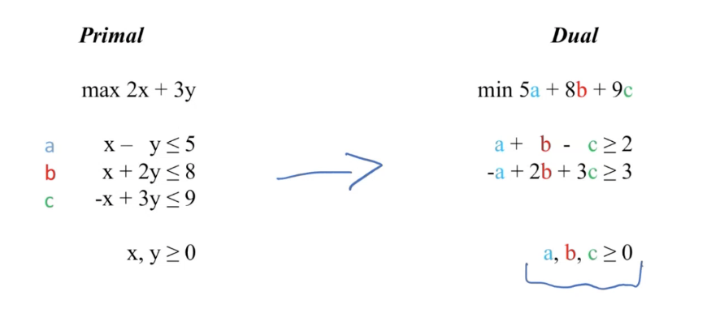

## 03/20 Office Hour Notes 
Notes taken from 03/21 office hours. 
You need to understand the concepts and how these things work. We are looking to test your fundamental understanding of the material. Go through the practice problems in HW7, the recommended practice problems. Working through these things manually will reinforce the concepts.

Hints:
- You should understand the strategy behind simplex. 
- We are not asking you to solve simplex in the context of the exam
- Understand it to the extent the lectures go over it

### Finding Optimal Value of a Linear Program
#### General Form
Every linear program begins with a **objective function** which is either a **maximization** or a **minimization**.

Here we are maximizing `2x + 3y`. In addition, our objective function is subject to a series of constraints. 
* The first is the non-negativity constraint. This gives us our first set of potential values. Any point in the below shaded region is a potential value for `x` and `y`



* Once we have our non-negativity constraints, we get a series constraints across our different variables





```
Objective Function: max 2x + 3y
Constraints: x, y >= 0
             x - y <= 5
             x + 2y <= 8
             -x + 3y <= 9
```
We're constraining the possible values for `x` and `y` such that they meet these constraints. The points in the shaded area satisfy all of these constraints and is the **feasible region**.

A linear program that is **infeasible** does not have any solution.



The optimal value will be a point on the boundary region of the polyhedron which is formed by the intersection of all of the constraints.

There could be more than one combination of values for the variables which gives you the **optimal value**. There could be more than one point in the **feasible region**. In point that is optimal will be on the boundary of the polyhedron.

If an optimum exists for a LP, the set of possible points that gets you there, will include a point that is a vertex on this bounded region (which is how simplex works). Simplex works by walking the vertices of this feasible region and looking for the vertex that maximizes the objective function. 

The optimal value for an objective function will be a unique value. There may be more than one point which provides the optimal value. 

#### Matrix Vector Form
We also have the **Matrix Vector** form of a linear program.
```
Matrix-Vector: max c^T x
               Ax <= b
               x >= 0
```
* `x` is the set of variables
* `c` is the set of coefficients 
* `A(x) <= b`: b is the set of values to the right; A is the set of coefficients in the set of constraints
* `x` is our vector of variables

### Feasible vs. Infeasible 

The graph on the left represents a **feasible** linear program. Why? It's because there is an intersection of all of these half-planes that defines a **feasible** region for us. It is non-empty. Some value in here, any value in here, makes our LP feasible. 

What is a feasible linear program? It's one for which there is a set of values that satisfies all the constraints.

The graph on the right is an **infeasible region**. There is no intersection of all the half planes that defines a set of valid values for `x` and `y` to satisfy all the constraints.

### Bounded vs. Unbounded

Is this linear program **bounded** or **unbounded**? The answer is, it depends! It depends on the **objective function.**
```
max  x + y
max -x - y
```
If we want to maximize `x + y`, then the linear program is **unbounded**. Why? We can constantly increase `x + y` so there's no single maximum. 

However, maximizing `-x - y` is bounded. We want `x` and `y` to be as small as possible and will eventually run into a boundary of the feasible region which makes this a **bounded** linear program.

**Feasibility** has to deal with the constraints; is there a way to satisfy all the constraints? 

If a linear program is feasible, we can then discuss if a linear program is **bounded**. Whether it's bounded, it has to be a **feasible** program and one such that the objective function will lead to a single optimal solution.

### What is Standard Form for Linear Programs?
| The Lecture                          | The Book                                        |
|--------------------------------------|-------------------------------------------------|
| The variables are non-negative       | The variables are non-negative                  |
| Objective function is maximized      | Objective function is minimized                 |
| The constraints are described as     | The constraints are described as                |
| upper bounds (≤)                     | equality (=) through the use of slack variables |

There is no general consensus on what is "standard form". We use the format from the lecture, which is much easier to work with. 

### LP Format Guidelines
- All variables are subject to non-negativity constraints
- For the other constraints:
  - Equation on the left, constant on the right
  - With a `max` objective function, the constraints are upper bounds `≤`
  - With a `min` objective function, the constraints are lower bounds `≥`
  - Break equality (`=`) into two constraints  
    - For example, `x = 200` becomes `x ≥ 200` and `x ≤ 200`

These two are equivalent:
```
max  2x + 3y
min -2x - 3y
```
These two are also equivalent: 
```
x + 3y - 2 <= 4
-x -3y + 2 >= -4
```

### Converting between Primal and Dual
We have to convert between the two. The first thing we know, is that if the primal is a maximization, the dual minimizes. 



If the primal has 3 constraints, the dual has 3 variables. When I describe my minimization function of my dual, I use the new variables that I've assigned. 

The constants for your constraints become the coefficients for your dual.

For every variable in the primal, you will have constraint in the dual. 
### Duality Theorem