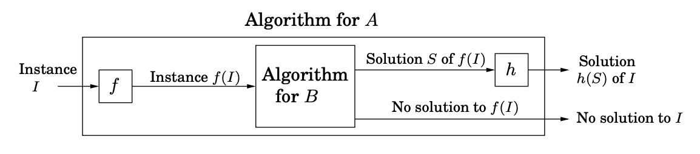

## Office Hour Notes
The following notes were compiled from office hours (Spring 2024).

### NP Theory
This is the essence of theoretical computing. Can a problem be solved efficiently?  We measure runtime based on the input size.

For a given input of size `n`: 
* **Polynomial Time:** `O(n^k)` for some constant `k`. These are _efficient_ problems to solve.
* **Exponential Time:** `O(k^n)` for some `k > 1`. These are _hard_ problems to solve.

Terminology:
* **P**: Polynomial Time
* **NP**: Non-deterministic Polynomial Time

### Non-Deterministic Polynomial Time
What does non-deterministic polynomial time mean? 
It means a problem could be solved in polynomial time **if** the computer is non-deterministic.

#### What do we mean by that? 
Think of an all-knowing oracle. Whenever it has to make a choice, it makes the right choice.

Think of the Traveling Salesman Problem (TSP). Whenever you get to a city, you choose the right next city to go to. This is non-deterministic. 

_You're always making the best choice, regardless of the number of choices._

In other words, non-deterministic polynomial time means that you can solve the problem in polynomial time on a non-deterministic computer. (You may thank Alan Turing for this, who came up with these ideas.) 

However, the rub is that all of the computers that we work with today are deterministic. 

If we take the TSP problem, if you get to a city and you got to pick the next city, you have to re-evaluate them all and go through all of the permutations. This is what a deterministic computer does. 

If we had a non-deterministic computer, we could solve TSP quickly. However, we cannot today. 

There is hope that quantum computing will give us the non-deterministic computer because it can examine all computers at once. 

### The Class of Problems
We think of problems as belonging to a class. 

* **Class P**: A solution may be found in polynomial time (easy)
* **Class NP**: A solution may be verified in polynomial time
* **NP Hard**: We are yet to find a polynomial-time solution
* **NP Complete**: Both in NP and at least as hard as NP Hard problems

There is a huge outstanding theoretical computing -- the P vs NP debate. Does P equal NP or not? Why is this an open question? 

A problem is either **known** or **yet to be known** to be in P or NP.

We cannot prove the absence of a polynomial time algorithm today. We can only say we are yet to find one. We cannot prove the absence of polynomial time verification. We can only say that we are yet to find one. We cannot discount that some clever person is going to figure it out. 

The P vs. NP question - does P equal NP or not - this gives us two realities:
1. The first is the intersection in the chart on the left. Roughly 83% of computer scientists think that is reality, that P does not equal NP. 
2. There are roughly 11% of people that think on the right chart (citation needed). They think it's possible that P == NP and that it's all NP complete and the complexity classes will collapse on themselves, that factoring becomes easy. 
Nobody has been able to definitively prove one side or the other. 

### NP Complete Proofs
We're proving that some unknown Problem B is NP Complete:

1. Prove that the **unknown** Problem B is NP Complete by showing that it could be used to solve an instance _I_ of _A_, a known NP Complete problem.
2. You define _f_ and _h_ in your proof. These are the input and output transformations.

In this case, we're using a reduction to prove the _hardness_ of a problem. We reduce A to B to show that B is at least as hard as A: `A -> B`

#### Why does this work? 
We have some known problem `A`. We're taking problems that we assume are hard, such as SAT, Vertex Cover, Independent Set, and the like, and we reduce it to some unknown problem `B`. 

The argument is that if `A` is known to be hard, it does not have a polynomial time solution, then solving B can be used to solve `A`. 